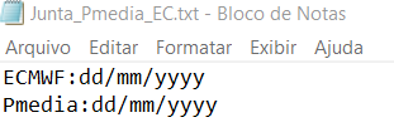
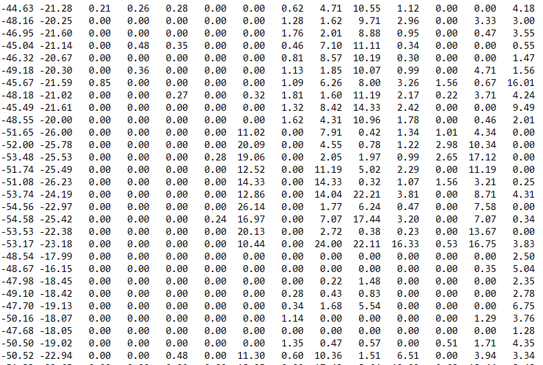
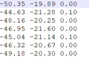
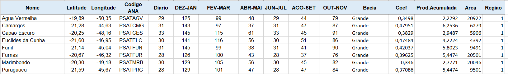
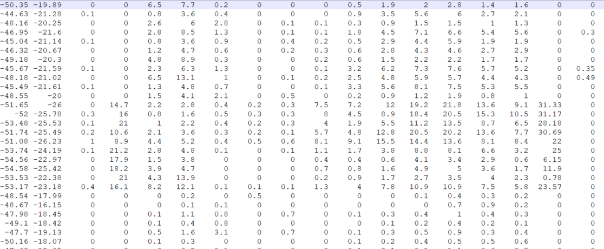

# Junta_Pmedia_EC

## Introdução
Esse código é parte do processo de previsão semanal de vazões do Operador Nacional do Sistema Elétrico (ONS) e tem como função juntar a previsão dos 14 primeiros dias do método Pmedia com os demais dias dos membros clusterizados do modelo do Centro Europeu. Para informações sobre as metodologias acessar o site https://ctpmopld.org.br/ .

## Arquivos de Entrada 

### **junta_Pmedia_EC.txt**
É um arquivo opcional que permite ao usuário especificar a rodada do Pmedia e do EC a serem combinadas caso seja utilizado deve estar na raiz da rodada junto ao [código](Junta_Pmedia_EC.R). O arquivo possui formato txt e deve conter duas linhas como o exemplo a seguir. Caso o usuário não especifique o [código](Junta_Pmedia_EC.R) utilizará como padrão a data do sistema para a rodada do Pmedia e irá considerar a data da última segunda ou quinta para o ECMWF. 

|Fig 1: Exemplo de arquivo junta_Pmedia_EC.txt|
|:-:|
||

### **ECMWF_m_ddmmyy_C{n}.dat**

Arquivo que contém a previsão do cluster **n** e deve estar na pasta [*Arq_Entrada/ECMWF*](./Arq_Entrada/ECMWF/). Na versão atual o código está organizado para rodar com número fixo de 10 clusters. O arquivo possui formato txt com 47 colunas as duas primeiras contêm a longitude e latitude e as demais as previsões de precipitação em sequência. O número de linhas é igual ao número de bacias smap em operação como mostrado na figura 2.

|Fig 2: Exemplo de arquivo ECMWF_m_ddmmyy_C{n}.dat|
|:-:|
||

### **PMEDIA_p{ddmmyy}a{ddmmyy}.dat**

Arquivos que contém as previsões do PMEDIA e deve estar na pasta [*Arq_Entrada/Pmedia*](./Arq_Entrada/Pmedia/). Atualmente o código espera 14 arquivos uma para cada dia de previsão, figura 3, com 3 colunas ( longitude, latitude e valor). O número de linhas, assim como no arquivo anterior, é igual ao número de bacias de smap. 

|Fig 3: Exemplo de arquivo PMEDIA_p{ddmmyy}a{ddmmyy}.dat|
|:-:|
||

### **Configuracao.xlsx**

Mesmo arquivo utilizado pelo método de remoção e clusterização do ECMWF. Nesse código sua única função é informar quais bacias do smap devem ser utilizadas e suas respectivas latitudes e longitudes, figura 4. Deve ser colocado na raiz junto ao código principal.

|Fig 3: Exemplo de arquivo de configuração.xlsx aba *dados*|
|:-:|
||

## Códigos

### **Junta_Pmedia_EC.R**

[Código](Junta_Pmedia_EC.R) que deve ser executado pelo usuário para gerar as saídas combinadas. Sua função é identificar a data das rodadas do Pmedia e do ECMWF ler os respectivos arquivos e chamar das funções que criam os arquivos de saida.

### **Junta_Pmedia_Funcoes.R**

Contém as funções que realizam a concatenação (**junta_arq_unico e junta_arq_multi**) além de uma função auxiliar de formatação de texto. Deve estar localizado dentro da pasta [codigos](./Codigos/). 

## Bibliotecas
Para a execução adaquada do código é necessário ter instalado as seguintes bibliotecas.

* **lubridate**
* **gdata**
* **parallel**
* **readxl**
* **lubridate**

## Arquivos de Saída

### **PM.ECMWF{n}_p{ddmmyy}a{ddmmyy}.dat**
Arquivo oficial da previsão de precipitação possui o mesmo formato do arquivo Pmedia com 3 colunas (longitude, latitude e valor) e será disponibilizado por pasta de cluster. Sempre serão gerados 45 arquivos mesmo que o horizonte do ECMWF seja inferior ao 45º dia, nesse caso os dias faltantes são preenchidos com a previsão do último dia. 

|Fig 3: Exemplo de arquivo PM.ECMWF{n}_p{ddmmyy}a{ddmmyy}.dat|
|:-:|
||

### **PM.ECMWF{n}_p{ddmmyy}a{ddmmyy}.dat**
Arquivo oficial da previsão de precipitação possui o mesmo formato do arquivo **Pmedia** com 3 colunas (longitude, latitude e valor) e será disponibilizado por pasta de cluster. Sempre serão gerados 45 arquivos mesmo que o horizonte do ECMWF seja inferior ao 45º dia, nesse caso os dias faltantes são preenchidos com a previsão do último dia. 

|Fig 4: Exemplo de arquivo PM.ECMWF{n}_p{ddmmyy}a{ddmmyy}.dat|
|:-:|
||

### **PM.ECMWF{n}_p{ddmmyy}a{ddmmyy}.dat - Pasta Unico**

Arquivo condensado no mesmo formato do arquivo de entrada **ECMWF** como 48 colunas( longitude, latitude, valor 1...valor 45), figura 5. Os 10 arquivos são gerados na pasta [unico](./Arq_Saida/unico/).

|Fig 5: Exemplo de arquivo PM.ECMWF{n}_p{ddmmyy}a{ddmmyy}.dat|
|:-:|
||

